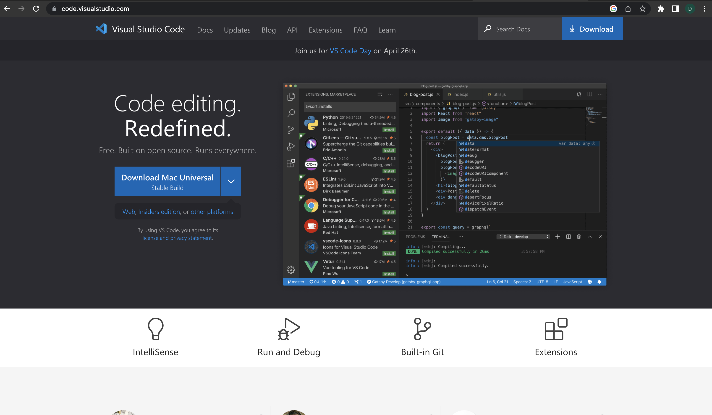
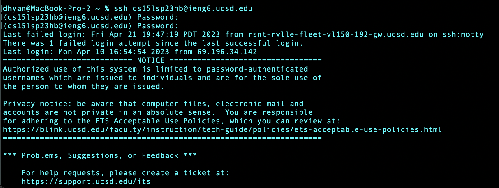
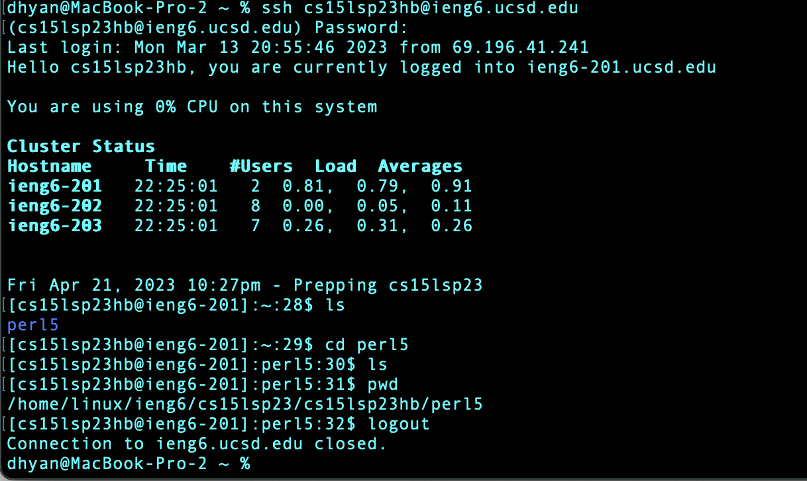

First, open the terminal on your computer or install Visual Studio Code from its [website](https://code.visualstudio.com/).

Look for your CSE15L SP23 username which can be found [here](https://sdacs.ucsd.edu/~icc/index.php)

Reset your password [here](https://password.ucsd.edu/)

Now enter the following command in your terminal:

`ssh cse15lusername@ieng6.ucsd.edu`

Enter your password when prompted and you will have successfully connected to the server

Now that you're logged in try typing some commands like:
To display all directories and files within the current directory
`ls`
To switch into the perl5 directory
`cd perl5`

To show the absolute path to the present working directory
`pwd`

To close the connection to the ieng6 server
`logout`

