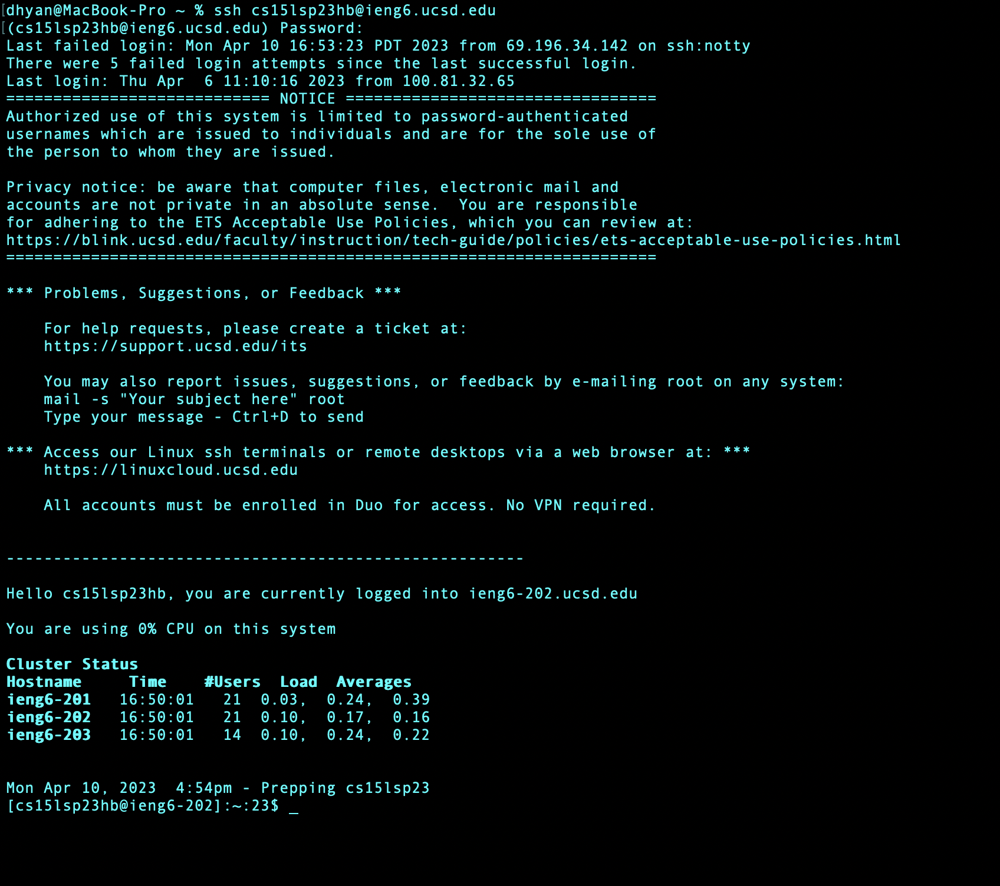
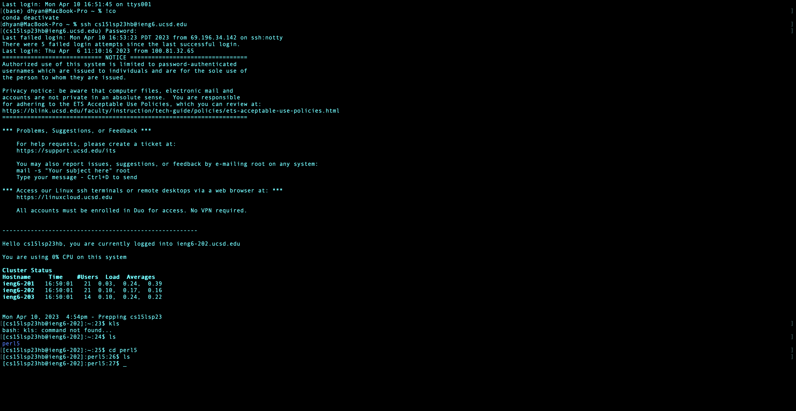

First, open the terminal on your computer or install Visual Studio Code from its [website](https://code.visualstudio.com/).

Look for your CSE15L SP23 username which can be found [here](https://sdacs.ucsd.edu/~icc/index.php)

Reset your password [here](https://password.ucsd.edu/)

Now enter the following command in your terminal:

`ssh cse15lusername@ieng6.ucsd.edu`

Enter your password when prompted and you will have successfully connected to the server

Below is the screenshot of a screen similar to what you will see along with some sample commands:

