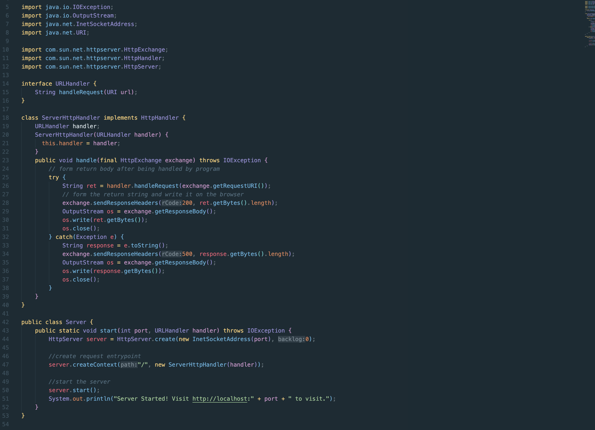
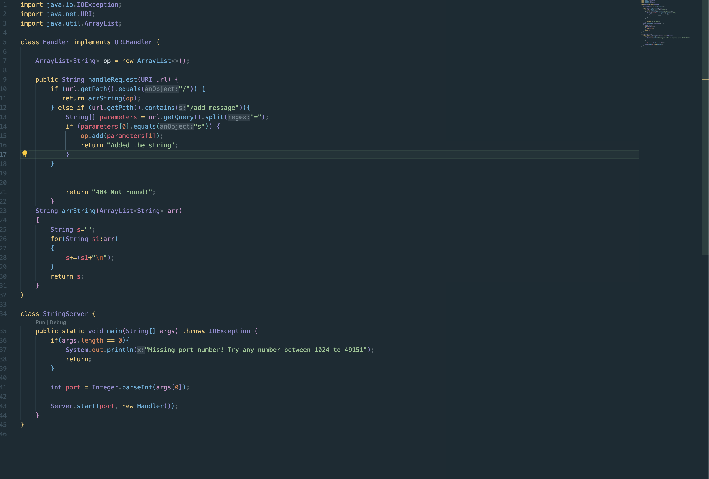
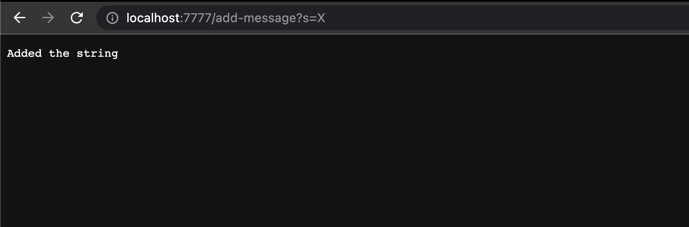

Here is the code for the StringServer along with Server which we are using to create a web server:

The code can be run by inputting the following commands in the terminal

`javac Server.java StringServer.java`

`java StringServer 7777`

Here 7777 is a port number and can be modified to any 16-bit unsigned integer

The site can now be visited at (localhost:7777)

The numbers after the colon depend on the port number you use while calling

Now we can use this for running queries on the web server

Here's a sample showing how to use the query in a URL to add an element to the page

After this, go back to the homepage and you should see the string you just added

