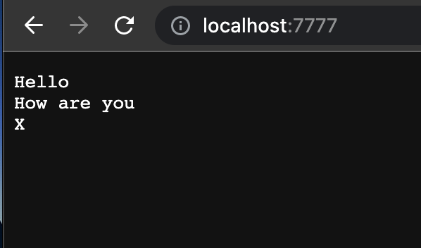
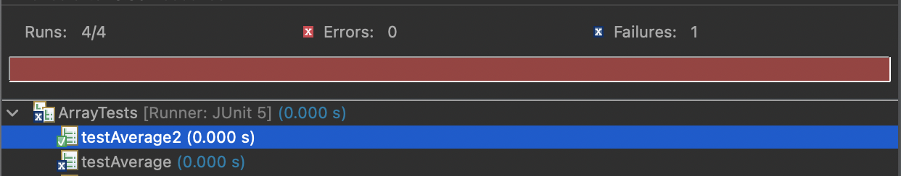

Here is the code for the StringServer which we are creating:

```
import java.io.IOException;
import java.net.URI;
import java.util.ArrayList;

class Handler implements URLHandler {
    ArrayList<String> words = new ArrayList<String>();

    public String handleRequest(URI url) {

        if (url.getPath().equals("/")) {
            return toString(words);

        } else if (url.getPath().contains("/add-message")) {

            String[] parameters = url.getQuery().split("=");

            if (parameters[0].equals("s")) {
                words.add(parameters[1]);

                return toString(words);
            }

        }

        return "404 Not Found!";
            
    }

    public static String toString(ArrayList<String> arr) {
        String result = "";

        for(int i = 0; i < arr.size(); i++) {
            result += arr.get(i) + "\n";
        }
        return result;
    }
}

class StringServer {
    public static void main(String[] args) throws IOException {
        if(args.length == 0){
            System.out.println("Missing port number! Try any number between 1024 to 49151");
            return;
        }

        int port = Integer.parseInt(args[0]);

        Server.start(port, new Handler());
    }
}

```
The code can be run by inputting the following commands in the terminal

`javac Server.java StringServer.java`

`java StringServer 7777`

Here 7777 is a port number and can be modified to any 16-bit unsigned integer

The site can now be visited at (localhost:7777)

The numbers after the colon depend on the port number you use while calling

Now we can use this for running queries on the web server

Here's a sample showing how to use the query in a URL to add an element to the page


You should see the string you just added on refreshing the webpage




There are 2 methods called during this process:

1. method handlerRequest(URI url)

This method allows us to effectively use the url passed as an argument to get the path, the query data, query type and even add content to our output list as specified. 

The method will throw an error when it is not given a valid URL as it will cause multiple problems while running.


2. method toString(String[] arr)

This takes the arr passed to it and converts it to a string in the required output format

Further, any query passed to the url will be typecasted to a string. So for example if 456 is given as a value, it will be read as "456" by the compiler when adding to the word array. 

Part 2:

```
@Test
 public void testAverage(){
    double[] input1 = {5,5,5,5,6};
    assertEquals(6.0, averageWithoutLowest(input1));
  }
@Test
  public void testAverage2() {
    double[] input1 = {1,2,3};
    assertEquals(2.5, averageWithoutLowest(input1));
  }
```

Here, in testAverage, we get the average as 1.5 even though we would expect 5.0 because the code we've written doesn't consider the scenario where multiple list elements are equal to the lowest value. This leads to an error in the output which could be fixed by considering the count of the lowest number in the lists.

For testAverage2, we get the correct expected value of 2.5

Here are the test results


The original code is as follows:

```
static double averageWithoutLowest(double[] arr) {
    if(arr.length < 2) { return 0.0; }
    double lowest = arr[0];
    for(double num: arr) {
      if(num < lowest) { lowest = num; }
    }
    double sum = 0;
    for(double num: arr) {
      if(num != lowest) { sum += num; }
    }
    return sum / (arr.length - 1);
  }
```


The fix for the code is as follows:


```
static double averageWithoutLowest(double[] arr) 
  {
    double sum=0;
    double lowest=arr[0];
    int c=0;
    if (arr.length<2)return 0;
    for(double i:arr)
    {
    	if(i==lowest)
    	else if(i<lowest)lowest=i;
    }

    for(double i:arr)
    {
    	if(i>lowest)sum+=i;
	if(i==lowest)c++;
    }
    return sum/(arr.length-c);
  }
```

This modified code now gives us the valid expected output of 1.5

Part 3:


I learned how to set up a web server and create queries. I also learned how to write functionalities like adding a query, removing a query and replacing a query. I also learned to write good unit tests and developed the skill of reworking a solution to a problem if it fails for specific edge cases.
