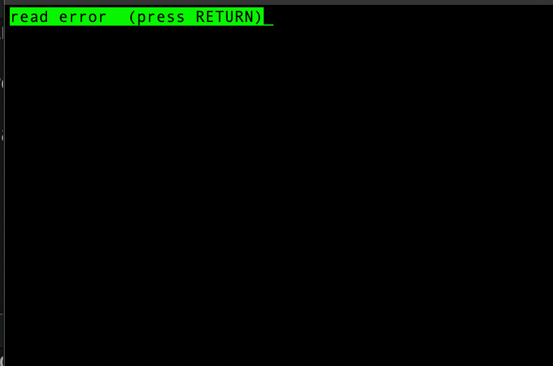
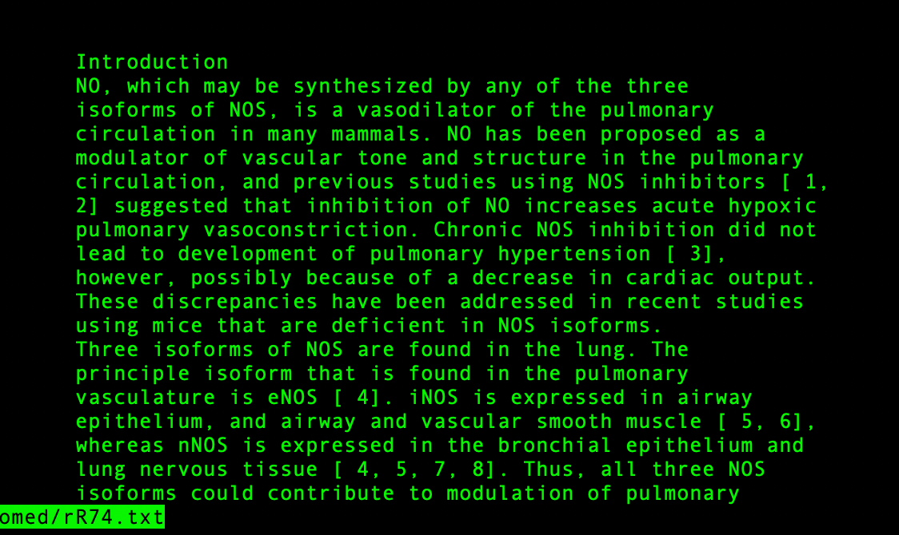
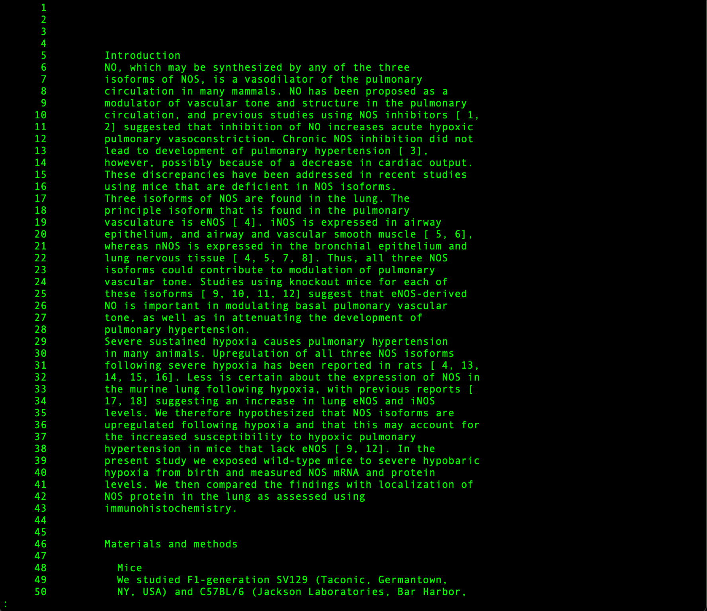
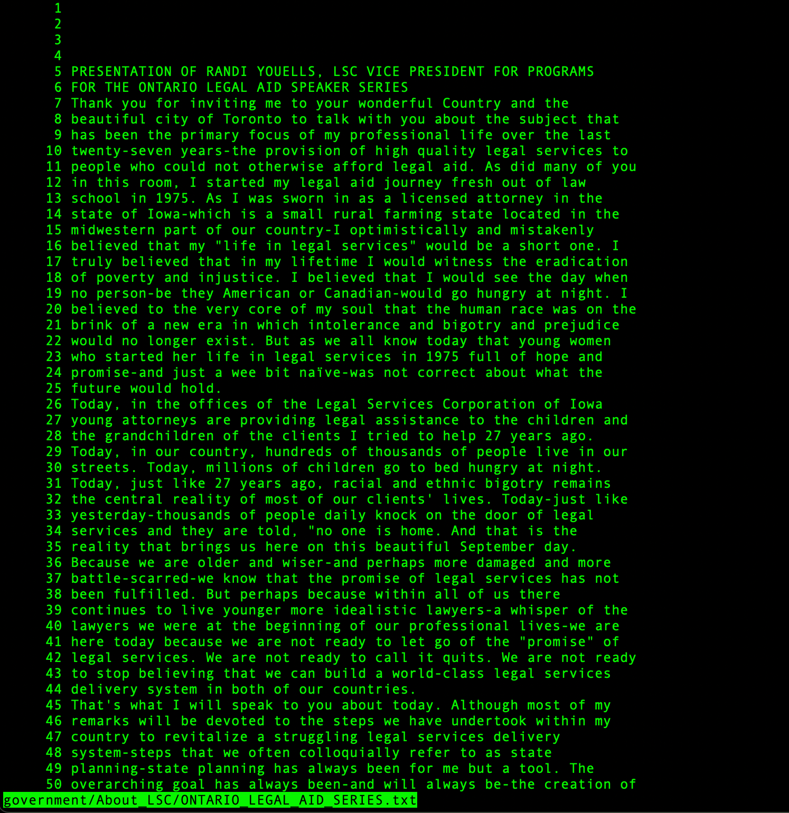

The `less` command

Option 1: `less -f`

This option forces less to open the file even if it is a directory. While using less without this option leads to an error, using the option tries to open it and then open the directory.

For example, without -f, we get the following output:

```
dhyan@MacBook-Pro-6 technical % less biomed
biomed is a directory
```

However, with -f, we get the following output:

```
dhyan@MacBook-Pro-6 technical % less-f biomed
```




With -f or without, we get the same output in both cases if we give it a file i.e., it reads the entire file


```
dhyan@MacBook-Pro-6 technical % less -f biomed/1468-6708-3-1.txt
dhyan@MacBook-Pro-6 technical % less biomed/1468-6708-3-1.txt
```
Both commands will give the same output


Option 2: `less -i`


The -i option ignores case sensitivity while searching i.e., 

```
dhyan@MacBook-Pro-6 technical % less -I biomed/rR74.txt
dhyan@MacBook-Pro-6 technical % less biomed/rr74.txt
```
 
Will give the same output





Option 2: `less -N`


The -N option add line numbers to the output

```
dhyan@MacBook-Pro-6 technical % less -N biomed/rr74.txt
dhyan@MacBook-Pro-6 technical % less -N government/About_LSC/ONTARIO_LEGAL_AID_SERIES.txt

```
 
Will give the outputs



