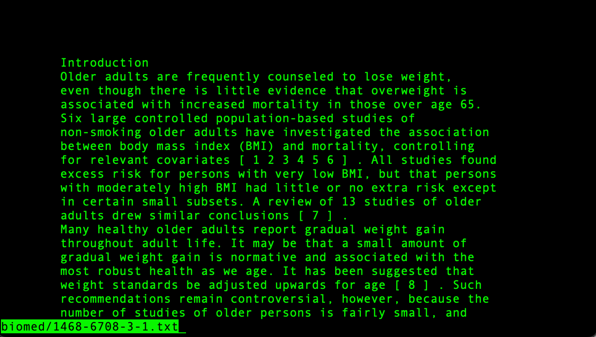
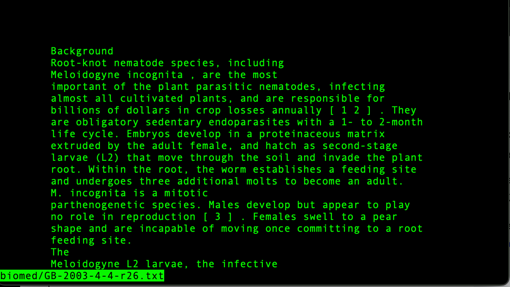
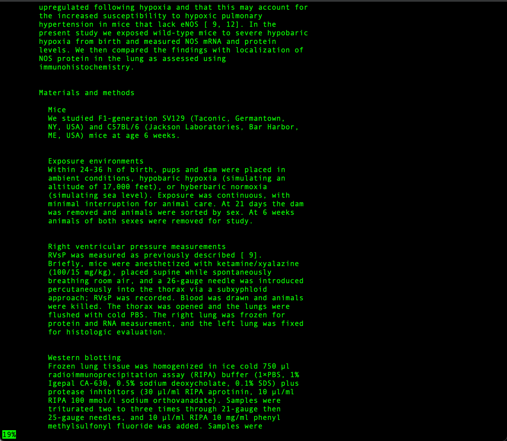
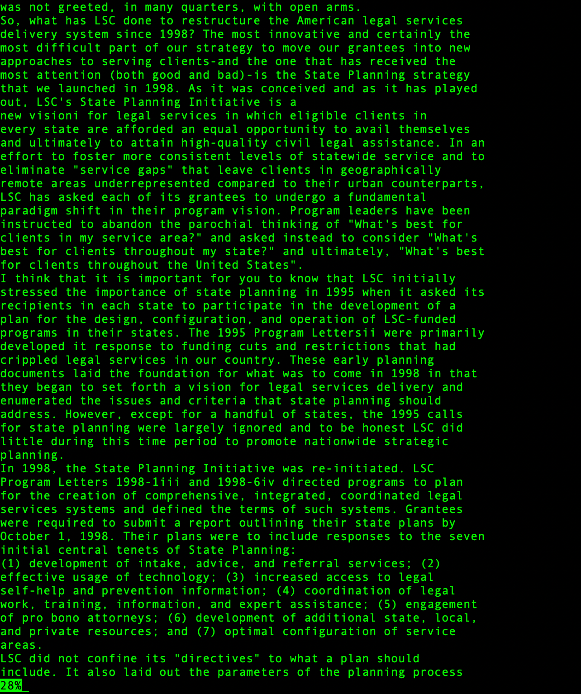

The `less` command

Option 1: `less -f`

This option forces less to open the file even if it is a directory. While using less without this option leads to an error, using the option tries to open it and then open the directory.

For example, without `-f`, we get the following output:

```
dhyan@MacBook-Pro-6 technical % less biomed
biomed is a directory
```

However, with `-f`, we get the following output:

```
dhyan@MacBook-Pro-6 technical % less -f biomed
```


With `-f` or without, we get the same output in both cases if we give it a file i.e., it reads the entire file.


```
dhyan@MacBook-Pro-6 technical % less -f biomed/1468-6708-3-1.txt
dhyan@MacBook-Pro-6 technical % less biomed/1468-6708-3-1.txt
```
Both commands will give the same output i.e., they will read the contents of the file.




Option 2: `less -i`


The `-i` option ignores case sensitivity while searching i.e., 

```
dhyan@MacBook-Pro-6 technical % less -i biomed/rR74.txt
dhyan@MacBook-Pro-6 technical % less -i biomed/rr74.txt
```

 
Will give the same output:


Using `less -i` for a different file:

`dhyan@MacBook-Pro-7 technical % less -f biomed/GB-2003-4-4-r26.txt`

We get the following output:




Further, we see that the name of the file at the bottom of the terminal window is modified to be in line with the input we give it.

For example, even though the file is actually named gb-2003-4-4-r26.txt, we see GB-2003-4-4-r26.txt at the bottom of our screen.

Option 3: `less -N`


The `-N` option add line numbers to the output as seen below:

```
dhyan@MacBook-Pro-6 technical % less -N biomed/rr74.txt
dhyan@MacBook-Pro-6 technical % less -N government/About_LSC/ONTARIO_LEGAL_AID_SERIES.txt

```
 
Will give the following outputs:


Option 4: `less -m`


The `-m` option adds the percentage of the file covered to the output.

For example, when we run the following commands, we see the screens attached below:


```
dhyan@MacBook-Pro-6 technical % less -m biomed/rr74.txt
dhyan@MacBook-Pro-6 technical % less -m government/About_LSC/ONTARIO_LEGAL_AID_SERIES.txt

```






Sources:

`man less` on the command line

[Unix Less Options](https://phoenixnap.com/kb/less-command-in-linux)
