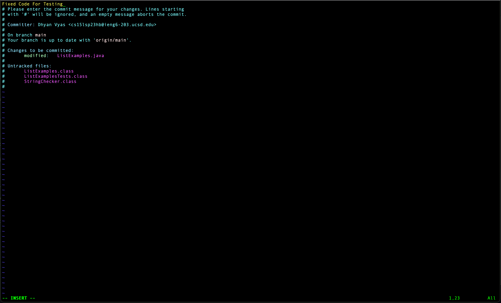

Lab Report 4


Step 1(4):


`!ss<enter>`


Step 2(5):


`git clone <Command+V><enter>`


Step 3(6):

```
cd lab7
bash te<tab><enter> 
```


Step 4(7):

```
vi ListExamples.java<enter>
<down>*40 I <backspace> 2 <esc> :wq<enter>
```


Step 5(8):


`!ba<enter>`


Step 6(9):
```
git add Li<tab>.java <enter>
git commit <enter>
i Fixed Code For Testing <esc> :wq <enter>
git push origin<enter>  
```





