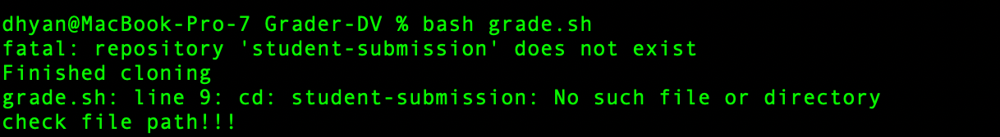
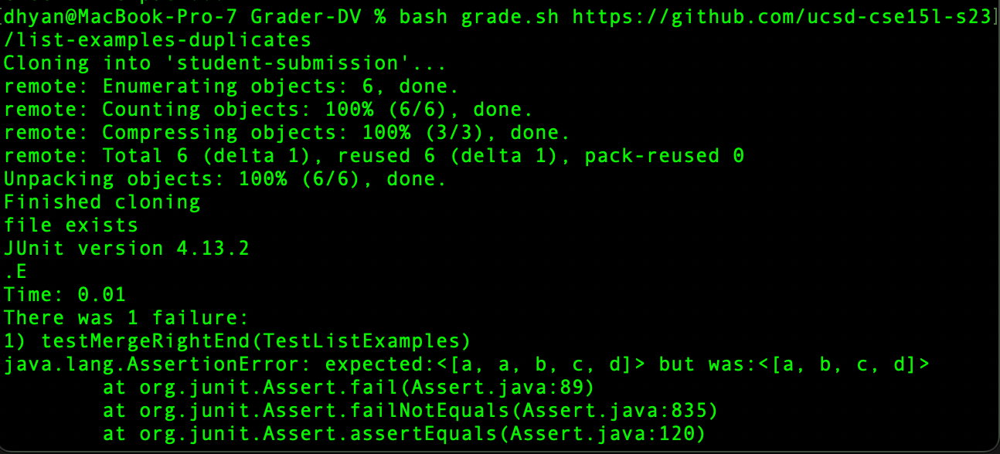

Lab Report 5


What environment are you using (computer, operating system, web browser, terminal/editor, and so on)?


I am using a MacBook with macOS 13.0. The tests are being run through the bash terminal on a Mac but seem to keep giving me a no such file error even though it definitely exists.


Detail the symptom you're seeing. Be specific; include both what you're seeing and what you expected to see instead. Screenshots are great, copy-pasted terminal output is also great. Avoid saying “it doesn't work”.


```
dhyan@MacBook-Pro-7 Grader-DV % bash grade.sh 
fatal: repository 'student-submission' does not exist
Finished cloning
grade.sh: line 9: cd: student-submission: No such file or directory
check file path!!!
```

My terminal says this instead of running the tests. The student-submissions folder is shown when I use the `ls` command.


Detail the failure-inducing input and context. That might mean any or all of the command you're running, a test case, command-line arguments, working directory, even the last few commands you ran. Do your best to provide as much context as you can.


I am basically trying to run the autograder script from the last lab using the bash script


TA Response:

Hi XYZ, I think you're missing an argument which needs to be passed for running the script. Look at your bash script once again and you should see what you're missing :)





Student Conclusion:

The student forgot to add the link to the GitHub repository that was being cloned. 




Setup:

Files & Directory Structure: Autograder Script from Week 8 Lab
Contents of each file: 

GradeServer.java-

```
Last login: Wed May 31 15:45:06 on ttys000
(base) dhyan@MacBook-Pro-7 ~ % !co
conda deactivate 
dhyan@MacBook-Pro-7 ~ % cd Documents/GitHub 
dhyan@MacBook-Pro-7 GitHub % ls
Grader-DV		docsearch		list-examples-grader
cse-15l-lab-reports	lab3			wavelet
dhyan@MacBook-Pro-7 GitHub % cd list-examples-grader 
dhyan@MacBook-Pro-7 list-examples-grader % ls
GradeServer.java	grade.sh		student-submission
Server.java		grading-area
TestListExamples.java	lib
dhyan@MacBook-Pro-7 list-examples-grader % bash grade.sh 
fatal: repository 'student-submission' does not exist
Finished cloning
grade.sh: line 9: cd: student-submission: No such file or directory
check file path!!!
dhyan@MacBook-Pro-7 list-examples-grader % ld                     
ld: warning: platform not specified
ld: warning: -arch not specified
ld: warning: No platform min-version specified on command line
ld: no object files specified
dhyan@MacBook-Pro-7 list-examples-grader % ls
GradeServer.java	TestListExamples.java	grading-area
Server.java		grade.sh		lib
dhyan@MacBook-Pro-7 list-examples-grader % cd ..
dhyan@MacBook-Pro-7 GitHub % ls         
Grader-DV		docsearch		list-examples-grader
cse-15l-lab-reports	lab3			wavelet
dhyan@MacBook-Pro-7 GitHub % cd lab3 
dhyan@MacBook-Pro-7 lab3 % ls
ArrayExamples.class	LectureExamples.java	MethodsTests.class
ArrayExamples.java	LinkedList.class	MethodsTests.java
ArrayTests.class	LinkedListExample.java	Node.class
ArrayTests.java		ListExamples.class	NumsExample.class
EvensExample.class	ListExamples.java	StringChecker.class
FileExample.class	MainExample1.class	lib
FileExample.java	MainExample2.class
dhyan@MacBook-Pro-7 lab3 % cd ..
dhyan@MacBook-Pro-7 GitHub % cd wavelet 
dhyan@MacBook-Pro-7 wavelet % ls
Handler.class		SearchEngine.class	ServerHttpHandler.class
NumberServer.class	SearchEngine.java	URLHandler.class
NumberServer.java	Server.class
README.md		Server.java
dhyan@MacBook-Pro-7 wavelet % cd ..
dhyan@MacBook-Pro-7 GitHub % cd Grader-DV 
dhyan@MacBook-Pro-7 Grader-DV % ls
GradeServer.java	grade.sh		student-submission
Server.java		grading-area
TestListExamples.java	lib
dhyan@MacBook-Pro-7 Grader-DV % bash grad
bash: grad: No such file or directory
dhyan@MacBook-Pro-7 Grader-DV % bash grade.sh 
fatal: repository 'student-submission' does not exist
Finished cloning
grade.sh: line 9: cd: student-submission: No such file or directory
check file path!!!
dhyan@MacBook-Pro-7 Grader-DV % bash grade.sh https://github.com/ucsd-cse15l-s23/grader-skill-demo2
Cloning into 'student-submission'...
remote: Enumerating objects: 44, done.
remote: Counting objects: 100% (44/44), done.
remote: Compressing objects: 100% (25/25), done.
remote: Total 44 (delta 19), reused 44 (delta 19), pack-reused 0
Unpacking objects: 100% (44/44), done.
Finished cloning
check file path!!!
dhyan@MacBook-Pro-7 Grader-DV % bash grade.sh https://github.com/ucsd-cse15l-s23/list-examples-duplicates
Cloning into 'student-submission'...
remote: Enumerating objects: 6, done.
remote: Counting objects: 100% (6/6), done.
remote: Compressing objects: 100% (3/3), done.
remote: Total 6 (delta 1), reused 6 (delta 1), pack-reused 0
Unpacking objects: 100% (6/6), done.
Finished cloning
file exists
JUnit version 4.13.2
.E
Time: 0.01
There was 1 failure:
1) testMergeRightEnd(TestListExamples)
java.lang.AssertionError: expected:<[a, a, b, c, d]> but was:<[a, b, c, d]>
	at org.junit.Assert.fail(Assert.java:89)
	at org.junit.Assert.failNotEquals(Assert.java:835)
	at org.junit.Assert.assertEquals(Assert.java:120)
	at org.junit.Assert.assertEquals(Assert.java:146)
	at TestListExamples.testMergeRightEnd(TestListExamples.java:19)

FAILURES!!!
Tests run: 1,  Failures: 1

dhyan@MacBook-Pro-7 Grader-DV % bash grade.sh 
fatal: repository 'student-submission' does not exist
Finished cloning
grade.sh: line 9: cd: student-submission: No such file or directory
check file path!!!
dhyan@MacBook-Pro-7 Grader-DV % bash grade.sh https://github.com/ucsd-cse15l-s23/list-examples-duplicates
Cloning into 'student-submission'...
remote: Enumerating objects: 6, done.
remote: Counting objects: 100% (6/6), done.
remote: Compressing objects: 100% (3/3), done.
remote: Total 6 (delta 1), reused 6 (delta 1), pack-reused 0
Unpacking objects: 100% (6/6), done.
Finished cloning
file exists
JUnit version 4.13.2
.E
Time: 0.01
There was 1 failure:
1) testMergeRightEnd(TestListExamples)
java.lang.AssertionError: expected:<[a, a, b, c, d]> but was:<[a, b, c, d]>
	at org.junit.Assert.fail(Assert.java:89)
	at org.junit.Assert.failNotEquals(Assert.java:835)
	at org.junit.Assert.assertEquals(Assert.java:120)
	at org.junit.Assert.assertEquals(Assert.java:146)
	at TestListExamples.testMergeRightEnd(TestListExamples.java:19)

FAILURES!!!
Tests run: 1,  Failures: 1

dhyan@MacBook-Pro-7 Grader-DV % ls
GradeServer.java	grade.sh		student-submission
Server.java		grading-area
TestListExamples.java	lib
dhyan@MacBook-Pro-7 Grader-DV % vi GradeServer.java 

            System.out.println("Missing port number! Try any number between 1024 to 49151");
            return;
        }

        int port = Integer.parseInt(args[0]);

        Server.start(port, new Handler());
    }
}

class ExecExamples {
  public static void main(String[] args) throws IOException {
    String[] cmd1 = {"ls", "lib"};
    System.out.println(ExecHelpers.exec(cmd1));

    String[] cmd2 = {"pwd"};
    System.out.println(ExecHelpers.exec(cmd2));

    String[] cmd3 = {"touch", "a-new-file.txt"};
    System.out.println(ExecHelpers.exec(cmd3));
  }
}


```

Server.java

```
Last login: Wed May 31 15:45:06 on ttys000
(base) dhyan@MacBook-Pro-7 ~ % !co
conda deactivate 
dhyan@MacBook-Pro-7 ~ % cd Documents/GitHub 
dhyan@MacBook-Pro-7 GitHub % ls
Grader-DV		docsearch		list-examples-grader
cse-15l-lab-reports	lab3			wavelet
dhyan@MacBook-Pro-7 GitHub % cd list-examples-grader 
dhyan@MacBook-Pro-7 list-examples-grader % ls
GradeServer.java	grade.sh		student-submission
Server.java		grading-area
TestListExamples.java	lib
dhyan@MacBook-Pro-7 list-examples-grader % bash grade.sh 
fatal: repository 'student-submission' does not exist
Finished cloning
grade.sh: line 9: cd: student-submission: No such file or directory
check file path!!!
dhyan@MacBook-Pro-7 list-examples-grader % ld                     
ld: warning: platform not specified
ld: warning: -arch not specified
ld: warning: No platform min-version specified on command line
ld: no object files specified
dhyan@MacBook-Pro-7 list-examples-grader % ls
GradeServer.java	TestListExamples.java	grading-area
Server.java		grade.sh		lib
dhyan@MacBook-Pro-7 list-examples-grader % cd ..
dhyan@MacBook-Pro-7 GitHub % ls         
Grader-DV		docsearch		list-examples-grader
cse-15l-lab-reports	lab3			wavelet
dhyan@MacBook-Pro-7 GitHub % cd lab3 
dhyan@MacBook-Pro-7 lab3 % ls
ArrayExamples.class	LectureExamples.java	MethodsTests.class
ArrayExamples.java	LinkedList.class	MethodsTests.java
ArrayTests.class	LinkedListExample.java	Node.class
ArrayTests.java		ListExamples.class	NumsExample.class
EvensExample.class	ListExamples.java	StringChecker.class
FileExample.class	MainExample1.class	lib
FileExample.java	MainExample2.class
dhyan@MacBook-Pro-7 lab3 % cd ..
dhyan@MacBook-Pro-7 GitHub % cd wavelet 
dhyan@MacBook-Pro-7 wavelet % ls
Handler.class		SearchEngine.class	ServerHttpHandler.class
NumberServer.class	SearchEngine.java	URLHandler.class
NumberServer.java	Server.class
README.md		Server.java
dhyan@MacBook-Pro-7 wavelet % cd ..
dhyan@MacBook-Pro-7 GitHub % cd Grader-DV 
dhyan@MacBook-Pro-7 Grader-DV % ls
GradeServer.java	grade.sh		student-submission
Server.java		grading-area
TestListExamples.java	lib
dhyan@MacBook-Pro-7 Grader-DV % bash grad
bash: grad: No such file or directory
dhyan@MacBook-Pro-7 Grader-DV % bash grade.sh 
fatal: repository 'student-submission' does not exist
Finished cloning
grade.sh: line 9: cd: student-submission: No such file or directory
check file path!!!
dhyan@MacBook-Pro-7 Grader-DV % bash grade.sh https://github.com/ucsd-cse15l-s23/grader-skill-demo2
Cloning into 'student-submission'...
remote: Enumerating objects: 44, done.
remote: Counting objects: 100% (44/44), done.
remote: Compressing objects: 100% (25/25), done.
remote: Total 44 (delta 19), reused 44 (delta 19), pack-reused 0
Unpacking objects: 100% (44/44), done.
Finished cloning
check file path!!!
dhyan@MacBook-Pro-7 Grader-DV % bash grade.sh https://github.com/ucsd-cse15l-s23/list-examples-duplicates
Cloning into 'student-submission'...
remote: Enumerating objects: 6, done.
remote: Counting objects: 100% (6/6), done.
remote: Compressing objects: 100% (3/3), done.
remote: Total 6 (delta 1), reused 6 (delta 1), pack-reused 0
Unpacking objects: 100% (6/6), done.
Finished cloning
file exists
JUnit version 4.13.2
.E
Time: 0.01
There was 1 failure:
1) testMergeRightEnd(TestListExamples)
java.lang.AssertionError: expected:<[a, a, b, c, d]> but was:<[a, b, c, d]>
	at org.junit.Assert.fail(Assert.java:89)
	at org.junit.Assert.failNotEquals(Assert.java:835)
	at org.junit.Assert.assertEquals(Assert.java:120)
	at org.junit.Assert.assertEquals(Assert.java:146)
	at TestListExamples.testMergeRightEnd(TestListExamples.java:19)

FAILURES!!!
Tests run: 1,  Failures: 1

dhyan@MacBook-Pro-7 Grader-DV % bash grade.sh 
fatal: repository 'student-submission' does not exist
Finished cloning
grade.sh: line 9: cd: student-submission: No such file or directory
check file path!!!
dhyan@MacBook-Pro-7 Grader-DV % bash grade.sh https://github.com/ucsd-cse15l-s23/list-examples-duplicates
Cloning into 'student-submission'...
remote: Enumerating objects: 6, done.
remote: Counting objects: 100% (6/6), done.
remote: Compressing objects: 100% (3/3), done.
remote: Total 6 (delta 1), reused 6 (delta 1), pack-reused 0
Unpacking objects: 100% (6/6), done.
Finished cloning
file exists
JUnit version 4.13.2
.E
Time: 0.01
There was 1 failure:
1) testMergeRightEnd(TestListExamples)
java.lang.AssertionError: expected:<[a, a, b, c, d]> but was:<[a, b, c, d]>
	at org.junit.Assert.fail(Assert.java:89)
	at org.junit.Assert.failNotEquals(Assert.java:835)
	at org.junit.Assert.assertEquals(Assert.java:120)
	at org.junit.Assert.assertEquals(Assert.java:146)
	at TestListExamples.testMergeRightEnd(TestListExamples.java:19)

FAILURES!!!
Tests run: 1,  Failures: 1

dhyan@MacBook-Pro-7 Grader-DV % ls
GradeServer.java	grade.sh		student-submission
Server.java		grading-area
TestListExamples.java	lib
dhyan@MacBook-Pro-7 Grader-DV % vi GradeServer.java 
dhyan@MacBook-Pro-7 Grader-DV % vi Server.java        

        } catch(Exception e) {
            String response = e.toString();
            exchange.sendResponseHeaders(500, response.getBytes().length);
            OutputStream os = exchange.getResponseBody();
            os.write(response.getBytes());
            os.close();
        }
    }
}

public class Server {
    public static void start(int port, URLHandler handler) throws IOException {
        HttpServer server = HttpServer.create(new InetSocketAddress(port), 0);

        //create request entrypoint
        server.createContext("/", new ServerHttpHandler(handler));

        //start the server
        server.start();
        System.out.println("Server Started! Visit http://localhost:" + port + " to visit.");
    }
}


```

TestListExamples.java- 

```
Last login: Wed May 31 15:45:06 on ttys000
(base) dhyan@MacBook-Pro-7 ~ % !co
conda deactivate 
dhyan@MacBook-Pro-7 ~ % cd Documents/GitHub 
dhyan@MacBook-Pro-7 GitHub % ls
Grader-DV		docsearch		list-examples-grader
cse-15l-lab-reports	lab3			wavelet
dhyan@MacBook-Pro-7 GitHub % cd list-examples-grader 
dhyan@MacBook-Pro-7 list-examples-grader % ls
GradeServer.java	grade.sh		student-submission
Server.java		grading-area
TestListExamples.java	lib
dhyan@MacBook-Pro-7 list-examples-grader % bash grade.sh 
fatal: repository 'student-submission' does not exist
Finished cloning
grade.sh: line 9: cd: student-submission: No such file or directory
check file path!!!
dhyan@MacBook-Pro-7 list-examples-grader % ld                     
ld: warning: platform not specified
ld: warning: -arch not specified
ld: warning: No platform min-version specified on command line
ld: no object files specified
dhyan@MacBook-Pro-7 list-examples-grader % ls
GradeServer.java	TestListExamples.java	grading-area
Server.java		grade.sh		lib
dhyan@MacBook-Pro-7 list-examples-grader % cd ..
dhyan@MacBook-Pro-7 GitHub % ls         
Grader-DV		docsearch		list-examples-grader
cse-15l-lab-reports	lab3			wavelet
dhyan@MacBook-Pro-7 GitHub % cd lab3 
dhyan@MacBook-Pro-7 lab3 % ls
ArrayExamples.class	LectureExamples.java	MethodsTests.class
ArrayExamples.java	LinkedList.class	MethodsTests.java
ArrayTests.class	LinkedListExample.java	Node.class
ArrayTests.java		ListExamples.class	NumsExample.class
EvensExample.class	ListExamples.java	StringChecker.class
FileExample.class	MainExample1.class	lib
FileExample.java	MainExample2.class
dhyan@MacBook-Pro-7 lab3 % cd ..
dhyan@MacBook-Pro-7 GitHub % cd wavelet 
dhyan@MacBook-Pro-7 wavelet % ls
Handler.class		SearchEngine.class	ServerHttpHandler.class
NumberServer.class	SearchEngine.java	URLHandler.class
NumberServer.java	Server.class
README.md		Server.java
dhyan@MacBook-Pro-7 wavelet % cd ..
dhyan@MacBook-Pro-7 GitHub % cd Grader-DV 
dhyan@MacBook-Pro-7 Grader-DV % ls
GradeServer.java	grade.sh		student-submission
Server.java		grading-area
TestListExamples.java	lib
dhyan@MacBook-Pro-7 Grader-DV % bash grad
bash: grad: No such file or directory
dhyan@MacBook-Pro-7 Grader-DV % bash grade.sh 
fatal: repository 'student-submission' does not exist
Finished cloning
grade.sh: line 9: cd: student-submission: No such file or directory
check file path!!!
dhyan@MacBook-Pro-7 Grader-DV % bash grade.sh https://github.com/ucsd-cse15l-s23/grader-skill-demo2
Cloning into 'student-submission'...
remote: Enumerating objects: 44, done.
remote: Counting objects: 100% (44/44), done.
remote: Compressing objects: 100% (25/25), done.
remote: Total 44 (delta 19), reused 44 (delta 19), pack-reused 0
Unpacking objects: 100% (44/44), done.
Finished cloning
check file path!!!
dhyan@MacBook-Pro-7 Grader-DV % bash grade.sh https://github.com/ucsd-cse15l-s23/list-examples-duplicates
Cloning into 'student-submission'...
remote: Enumerating objects: 6, done.
remote: Counting objects: 100% (6/6), done.
remote: Compressing objects: 100% (3/3), done.
remote: Total 6 (delta 1), reused 6 (delta 1), pack-reused 0
Unpacking objects: 100% (6/6), done.
Finished cloning
file exists
JUnit version 4.13.2
.E
Time: 0.01
There was 1 failure:
1) testMergeRightEnd(TestListExamples)
java.lang.AssertionError: expected:<[a, a, b, c, d]> but was:<[a, b, c, d]>
	at org.junit.Assert.fail(Assert.java:89)
	at org.junit.Assert.failNotEquals(Assert.java:835)
	at org.junit.Assert.assertEquals(Assert.java:120)
	at org.junit.Assert.assertEquals(Assert.java:146)
	at TestListExamples.testMergeRightEnd(TestListExamples.java:19)

FAILURES!!!
Tests run: 1,  Failures: 1

dhyan@MacBook-Pro-7 Grader-DV % bash grade.sh 
fatal: repository 'student-submission' does not exist
Finished cloning
grade.sh: line 9: cd: student-submission: No such file or directory
check file path!!!
dhyan@MacBook-Pro-7 Grader-DV % bash grade.sh https://github.com/ucsd-cse15l-s23/list-examples-duplicates
Cloning into 'student-submission'...
remote: Enumerating objects: 6, done.
remote: Counting objects: 100% (6/6), done.
remote: Compressing objects: 100% (3/3), done.
remote: Total 6 (delta 1), reused 6 (delta 1), pack-reused 0
Unpacking objects: 100% (6/6), done.
Finished cloning
file exists
JUnit version 4.13.2
.E
Time: 0.01
There was 1 failure:
1) testMergeRightEnd(TestListExamples)
java.lang.AssertionError: expected:<[a, a, b, c, d]> but was:<[a, b, c, d]>
	at org.junit.Assert.fail(Assert.java:89)
	at org.junit.Assert.failNotEquals(Assert.java:835)
	at org.junit.Assert.assertEquals(Assert.java:120)
	at org.junit.Assert.assertEquals(Assert.java:146)
	at TestListExamples.testMergeRightEnd(TestListExamples.java:19)

FAILURES!!!
Tests run: 1,  Failures: 1

dhyan@MacBook-Pro-7 Grader-DV % ls
GradeServer.java	grade.sh		student-submission
Server.java		grading-area
TestListExamples.java	lib
dhyan@MacBook-Pro-7 Grader-DV % vi GradeServer.java 
dhyan@MacBook-Pro-7 Grader-DV % vi Server.java        
dhyan@MacBook-Pro-7 Grader-DV % ls
GradeServer.java	grade.sh		student-submission
Server.java		grading-area
TestListExamples.java	lib
dhyan@MacBook-Pro-7 Grader-DV % vi TestListExamples.java 

import static org.junit.Assert.*;
import org.junit.*;
import java.util.Arrays;
import java.util.List;

class IsMoon implements StringChecker {
  public boolean checkString(String s) {
    return s.equalsIgnoreCase("moon");
  }
}

public class TestListExamples {
  @Test(timeout = 500)
  public void testMergeRightEnd() {
    List<String> left = Arrays.asList("a", "b", "c");
    List<String> right = Arrays.asList("a", "d");
    List<String> merged = ListExamples.merge(left, right);
    List<String> expected = Arrays.asList("a", "a", "b", "c", "d");
    assertEquals(expected, merged);
  }
}
~                                                                               
~                                                                               
"TestListExamples.java" 21L, 594B

```
